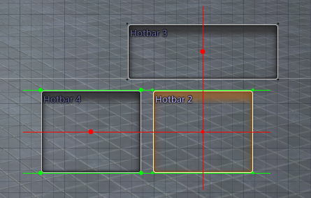

# HUDLayoutHelper

A Dalamud Plugin for FFXIV. 

- Copy and paste HUD element positions.
- Undo and redo movement of HUD elements (when using the mouse).
- Show an overlay that displays lines between the corners and centers of HUD elements to help align them. 

## How To Use
1. Open the HUD Layout Editor.
2. Use the following keybinds:
	- **Ctrl + C**: Copy selected HUD element.
	- **Ctrl + V**: Paste copied HUD element.
	- **Ctrl + Z**: Undo last action.
	- **Ctrl + Y**: Redo last action.
	- **Ctrl + R**: Toggle alignment helper overlay.

## Alignment Helper Overlay Visuals
The help lines are always shown for the currently selected HUD element in relation to all other HUD elements. 

**Red dots and lines**: center of HUD elements.  
**Green dots and lines**: corners of HUD elements.  
**Solid line**: completely aligned with another HUD element.  
**Faded line**: almost aligned with another HUD element.

### Sample image: 

