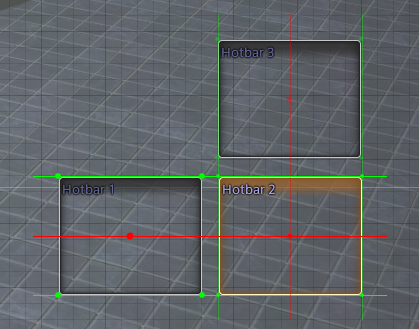

# HUDLayoutHelper

A Dalamud Plugin for FFXIV. 

- Copy and paste HUD element positions.
- Undo and redo movement of HUD elements (when using the mouse).
- Show an overlay that displays lines between the corners and centers of HUD elements to help align them. 

## How To Use
1. Open the HUD Layout Editor.
2. Use the following keybinds:
	- **Ctrl + C**: Copy selected HUD element.
	- **Ctrl + V**: Paste copied HUD element.
	- **Ctrl + Z**: Undo last action.
	- **Ctrl + Y**: Redo last action.
	- **Ctrl + R**: Toggle alignment helper overlay.

### Alignment Helper Overlay
When the alignment helper overlay is enabled, lines will be drawn between the corners and centers of the selected HUD element and other HUD elements to help align them. 

There are different colors and line styles for different types of alignment: 
- **Solid line**: the selected HUD element has one point (corner or center) that is fully aligned with another HUD element.  
- *Faded line*: the selected HUD element is close to being aligned with another HUD element.
- <code style="color : Red">Red lines and dots</code>: highlighting alignment with the centers of HUD elements.
- <code style="color : Green">Green lines and dots</code>: highlighting alignment with the corners of HUD elements.

## Images
#### Alignment Overlay

#### Window with Shortcut Hints
This window can be toggled on and off in the settings and displays the keybinds for the plugin. It is attached to the HUD Layout Editor window and will move with it. 

